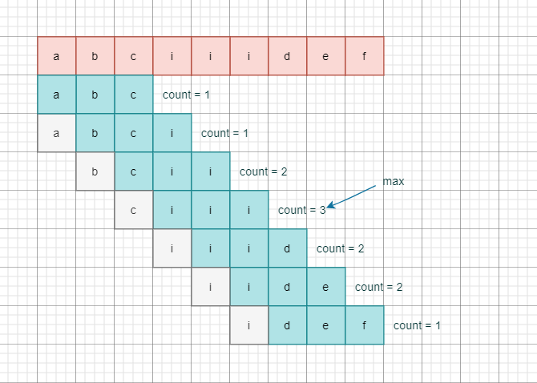

## 题目地址
https://leetcode.com/problems/maximum-number-of-vowels-in-a-substring-of-given-length/

## 题目描述
```
Given a string s and an integer k.

Return the maximum number of vowel letters in any substring of s with length k.

Vowel letters in English are (a, e, i, o, u).

Example 1:

Input: s = "abciiidef", k = 3
Output: 3
Explanation: The substring "iii" contains 3 vowel letters.

Example 2:

Input: s = "aeiou", k = 2
Output: 2
Explanation: Any substring of length 2 contains 2 vowels.

Example 3:

Input: s = "leetcode", k = 3
Output: 2
Explanation: "lee", "eet" and "ode" contain 2 vowels.

Example 4:

Input: s = "rhythms", k = 4
Output: 0
Explanation: We can see that s doesn't have any vowel letters.

Example 5:

Input: s = "tryhard", k = 4
Output: 1
 
Constraints:

1 <= s.length <= 10^5
s consists of lowercase English letters.
1 <= k <= s.length
```

## 思路

看到题目第一个想法就是滑动窗口了，因为子字符串的长度 k 是固定的，所以真的很简单。

- 使用一个长度为 k 的窗口从 s 的左侧滑向右侧
- 分别计算窗口中包含的元音个数，最终返回最大值

要点是如何计算窗口中的元音个数？如果窗口每移动一步就遍历计算一次，必然是超时的。

其实仔细想想，窗口每次移动时，其中包含的元素只有两个变化：

1. 窗口左侧丢弃了一个元素
2. 窗口右侧新增了一个元素

那这样我们只需要在滑动开始时记录一下窗口中的元音个数 `count`，之后移动窗口时判断左侧丢弃的元素和右侧新增的元素是不是元音，对应地减少或者增加 `count` 就行。



## 关键点解析

无

## 代码

* 语言支持：JS, Python

JavaScript Code
```js
/**
 * @param {string} s
 * @param {number} k
 * @return {number}
 */
var maxVowels = function (s, k) {
    const vowels = new Set(['a', 'e', 'i', 'o', 'u'])
    let count = 0,
        l = 0,
        r = 0
    while (r < k) {
        vowels.has(s[r]) && count++
        r++
    }
    let max = count
    while (r < s.length) {
        vowels.has(s[r]) && count++
        vowels.has(s[l]) && count--
        l++
        r++
        max = Math.max(max, count)
    }
    return max
};
```

Python Code
```py
class Solution(object):
    def maxVowels(self, s, k):
        """
        :type s: str
        :type k: int
        :rtype: int
        """
        vowels = 'aeiou'
        left = right = count = maxC = 0
        while right < k:
          if s[right] in vowels: count += 1
          right += 1

        maxC = count
        while right < len(s):
          if s[left] in vowels: count -= 1
          if s[right] in vowels: count += 1
          left += 1
          right += 1
          maxC = max(maxC, count)
        return maxC
```
