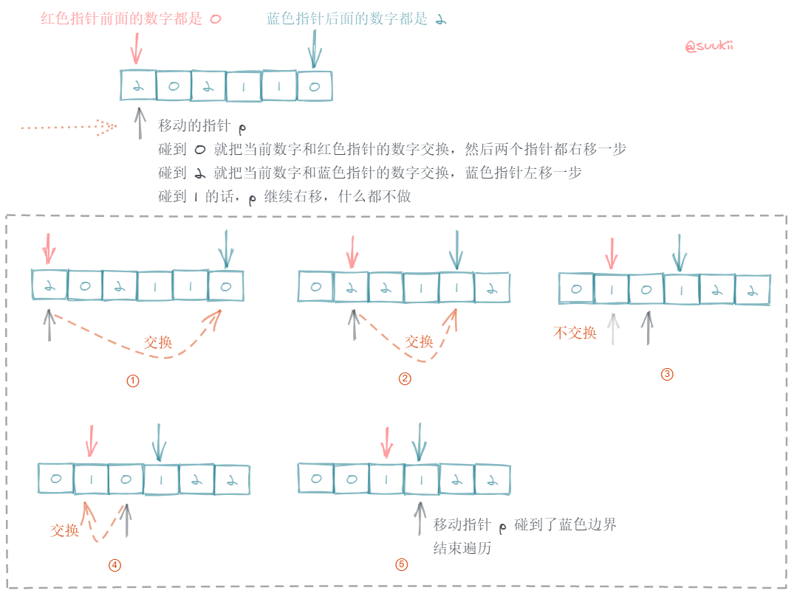

## 题目地址

https://leetcode-cn.com/problems/sort-colors/

## 题目描述
```
给定一个包含红色、白色和蓝色，一共 n 个元素的数组，原地对它们进行排序，使得相同颜色的元素相邻，并按照红色、白色、蓝色顺序排列。

此题中，我们使用整数 0、 1 和 2 分别表示红色、白色和蓝色。

注意:
不能使用代码库中的排序函数来解决这道题。

示例:

输入: [2,0,2,1,1,0]
输出: [0,0,1,1,2,2]
进阶：

一个直观的解决方案是使用计数排序的两趟扫描算法。
首先，迭代计算出0、1 和 2 元素的个数，然后按照0、1、2的排序，重写当前数组。
你能想出一个仅使用常数空间的一趟扫描算法吗？

来源：力扣（LeetCode）
链接：https://leetcode-cn.com/problems/sort-colors
著作权归领扣网络所有。商业转载请联系官方授权，非商业转载请注明出处。
```

## 思路

这道题可以转化成数组的排序问题，数组排序本身就有很多种方法了，除了题目中提到的计数排序，还有快排，冒泡等。

这里我们主要介绍一下三色旗排序 (Dutch national flag problem)。

荷兰国旗(红白蓝三色旗)问题是指，给定一些打乱顺序的红白蓝小球，要求把它们按照荷兰国旗的颜色分堆，并按照国旗颜色的顺序排列。

荷兰国旗问题其实可以看成是一个具体的数组排序问题，问题要求就是，把数组元素分成三类：`bottom`, `middle`, `top`，所有 `bottom` 元素必须放在 `middle` 前面，所有 `top` 元素必须放在 `middle` 后面。至于 `bottom`, `middle`, `top` 是不是递增排序的关系并不重要。

## 伪代码

```
我们使用三个指针：left, mid, right (left <= mid <= right)，数组元素可以分成四段，'[' 表示包括当前元素，'(' 表示不包括：

- [0, left) 是 bottom 元素
- [left, mid) 是 middle 元素
- [mid, right) 是待分堆的元素
- [right, end] 是 top 元素

遍历待分堆的元素，将它们归类：

// 当 [mid, right) 这个区间没有元素时停止遍历
while mid <= right:

  if array[mid] < middle:
    swap(mid, left)
    left++ // 维护 bottom 元素的边界
    mid++ // 换过来的是一个 middle 元素，不需要继续分类，所以下一次循环从 mid + 1 开始归类

  else if array[mid] > middle:
    swap(mid, right)
    right-- // 维护 top 元素的边界
    // 换过来的元素原本在 [mid, right) 区间中，是一个待分堆元素，所以下一次循环还是从 mid 开始归类

  else:
    mid++
    // 当前是一个 middle 元素，不需要交换，只要将 mid 右移一步扩大 [left, mid) 这个区间就行
  
```

## 图解



## 复杂度

- Time：$O(n)$，最多遍历一次数组，所以时间复杂度$O(n)$。
- Space: $O(1)$，直接在原数组上进行修改，没有用到额外空间，所以空间复杂度是 $O(1)$。

## 代码

* 语言支持：JS, Python

JavaScript Code
```js
/**
 * @param {number[]} nums
 * @return {void} Do not return anything, modify nums in-place instead.
 */
var sortColors = function (nums) {
  const swap = (list, p1, p2) => [list[p1], list[p2]] = [list[p2], list[p1]]
  const midKey = 1
  let red = 0,
    blue = nums.length - 1,
    p = 0

  while (p <= blue) {
    if (nums[p] < midKey) {
      swap(nums, red++, p)
      p++
    }
    else if (nums[p] > midKey) {
      swap(nums, blue--, p)
    }
    else {
      p++
    }
  }
};
```

Python Code
```py
class Solution(object):
  def sortColors(self, nums):
    """
    :type nums: List[int]
    :rtype: None Do not return anything, modify nums in-place instead.
    """
    midKey = 1
    left, mid, right = 0, 0, len(nums) - 1
    while mid <= right:
      if nums[mid] < midKey:
        nums[mid], nums[left] = nums[left], nums[mid]
        mid += 1
        left += 1
      elif nums[mid] > midKey:
        nums[mid], nums[right] = nums[right], nums[mid]
        right -= 1
      else:
        mid += 1
```